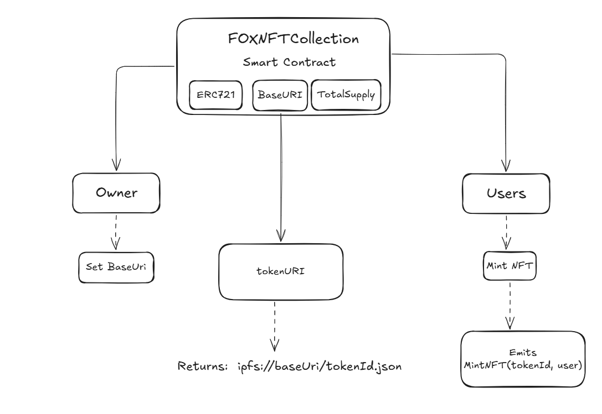

<div align="center">
  
# 🦊 Fox Society NFT – ERC721 Collection on Arbitrum  

&nbsp;
&nbsp;
&nbsp;


---



</div>

---

**Fox Society NFT** is a minimal yet powerful **ERC721 NFT collection** deployed on **Arbitrum One**, built with **OpenZeppelin** and **Foundry**.  
This project showcases how to build, deploy, and verify NFTs on-chain, using **IPFS for metadata storage**.

---

## :gear: Live Deployment
- **Network:** Arbitrum One  
- **Contract Address:** [0x921fb1eEbd609bD2e73e01A1aE7f3bF757d6A85F](https://arbiscan.io/address/0x921fb1eEbd609bD2e73e01A1aE7f3bF757d6A85F)  
- **Collection Name:** Fox Society NFT  
- **Symbol:** FOX  
- **Total Supply:** 2 NFTs  

---

## 🚀 Key Features
- **ERC721 Standard:** Fully compatible NFT implementation.  
- **Fixed Total Supply:** Minting capped at 2 NFTs.  
- **Dynamic Metadata:** `tokenURI` resolves JSON metadata from IPFS.  
- **Minting Function:** Any user can mint until supply runs out.  
- **Event Logging:** `MintNFT` event for each mint.  
- **Clean Architecture:** Built with OpenZeppelin contracts.  

---

<div align="center">
  
## 📂 Project Structure
</div>


---

## 🛠 Technologies   
- **Language:** Solidity ^0.8.24  
- **Framework:** [Foundry](https://book.getfoundry.sh/)  
- **Libraries:**  
  - [OpenZeppelin Contracts](https://github.com/OpenZeppelin/openzeppelin-contracts) (ERC721, Strings)  
- **Networks:** Arbitrum One (EVM-compatible)  

---

## 📦 Installation  

1. Clone the repository
```bash
git clone https://github.com/YOUR-USERNAME/fox-society-nft.git
cd fox-society-nft

2. Install dependencies

forge install
```

## 🚀 Deployment

Set up your .env file:
```bash
PRIVATE_KEY=your_private_key
RPC_URL=https://arb1.arbitrum.io/rpc
ETHERSCAN_API_KEY=your_arbiscan_api_key
```

Run the deployment script:
```bash
forge script script/DeployNFTCollection.s.sol \
  --rpc-url $RPC_URL \
  --private-key $PRIVATE_KEY \
  --broadcast
```

##  🔍 Verification

Verify the contract on Arbiscan with Foundry:
```bash
forge verify-contract \
  --chain-id 42161 \
  0x921fb1eEbd609bD2e73e01A1aE7f3bF757d6A85F \
  src/FOXNFTCollection.sol:FOXNFTCollection \
  --constructor-args $(cast abi-encode "constructor(string,string,uint256,string)" \
    "Fox Society NFT" \
    "FOX" \
    2 \
    "ipfs://bafybeia3qskm656d3krcvukeogxz45b4jhc6haaz7ozy4deivxjxpzv36a/") \
  --etherscan-api-key $ETHERSCAN_API_KEY
```
##  🧪 Testing

Run unit tests with Foundry:
```bash
forge test -vv
```
## 📜 License

MIT — Free to use, modify and share.

<div align="center">

👨‍💻 Author: Iván Ramírez

</div>

